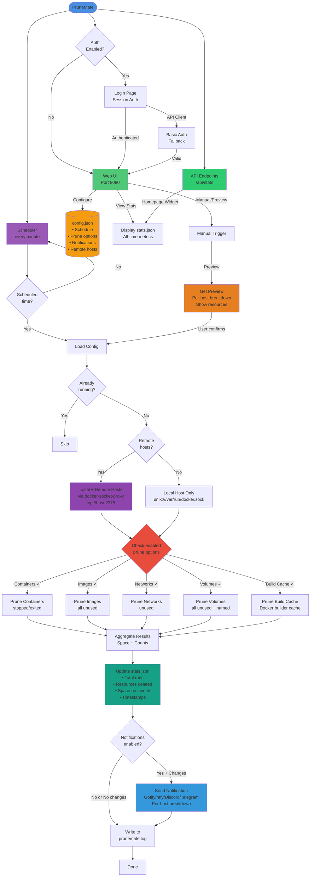

# PruneMate Architecture & Design

This document provides a detailed visual representation of PruneMate's internal architecture and workflow.

## System Architecture



## Component Descriptions

### Core Components

- **Web UI (Port 8080)**: Flask-based web interface for configuration and manual operations
- **Scheduler**: APScheduler running every minute to check if prune should execute
- **API Endpoints**: REST API for external integrations (e.g., Homepage dashboard)

### Configuration & State

- **config.json**: Persistent configuration including schedule, prune options, notifications, and remote hosts
- **stats.json**: Cumulative all-time statistics (space reclaimed, resources deleted, timestamps)
- **prunemate.lock**: File lock to prevent concurrent prune operations
- **last_run_key**: Tracks last successful scheduled run to prevent duplicates

### Prune Operations

- **Containers**: Removes stopped/exited/dead containers
- **Images**: Removes ALL unused images (not just dangling) using `filters={"dangling": False}`
- **Networks**: Removes unused networks (excluding default bridge/host/none)
- **Volumes**: Removes ALL unused volumes including named volumes using `filters={"all": True}`
- **Build Cache**: Removes Docker builder cache (can reclaim significant space, 10GB+)

### Multi-Host Support

- **Local Host**: Direct access via `unix:///var/run/docker.sock`
- **Remote Hosts**: Secure access via docker-socket-proxy at `tcp://host:2375`
- **Per-host Results**: Separate statistics and error handling for each host

### Notification Flow

- **Providers**: Gotify (self-hosted), ntfy.sh (pub-sub), Discord (webhooks), or Telegram (Bot API)
- **Authentication**: 
  - Gotify: App tokens
  - ntfy: Bearer tokens, Basic Auth, or unauthenticated
  - Discord: Webhook URLs
  - Telegram: Bot Token + Chat ID
- **Priority System**: Text-based (Low/Medium/High) with provider-specific behavior
  - Gotify: Numeric mapping (Low=2, Medium=5, High=8)
  - ntfy: Numeric mapping (Low=2, Medium=3, High=5)
  - Discord: Color mapping (Low=Green, Medium=Orange, High=Red)
  - Telegram: Notification sound (Low=Silent, Medium/High=Sound)
- **Smart Notifications**: Optional "only on changes" mode to reduce noise
- **Per-host Breakdown**: Detailed results for each Docker host in multi-host setups

## Workflow Explanation

1. **Trigger Sources**:
   - Scheduled: Minute-based scheduler checks if current time matches configured schedule
   - Manual: User clicks "Run now" after optionally previewing resources

2. **Preview Mode** (Manual only):
   - Queries each Docker host for unused resources
   - Shows detailed lists of what would be deleted
   - User must confirm before actual execution
   - Checkbox states auto-save when switching between preview and settings

3. **Execution**:
   - Acquires file lock to prevent concurrent runs
   - Loads latest configuration from disk
   - Connects to local and/or remote Docker hosts
   - Executes enabled prune operations per host
   - Aggregates results across all hosts

4. **Post-Execution**:
   - Updates cumulative statistics in stats.json
   - Sends notifications if enabled (respects "only on changes" setting)
   - Logs detailed results with timezone-aware timestamps
   - Releases file lock

## File Structure

```
/config/
├── config.json          # User configuration (persistent)
├── stats.json           # All-time statistics (cumulative data)
├── prunemate.lock       # Prevents concurrent runs
└── last_run_key         # Tracks last successful run

/var/log/
└── prunemate.log        # Application logs (rotating, 5MB max)
```

---

For more information, see the main [README.md](README.md).
