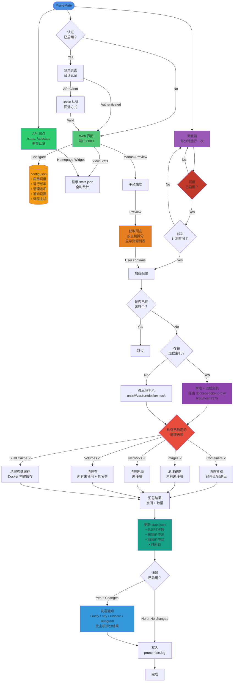

# PruneMate 架构与设计

本文档提供了 PruneMate 内部架构和工作流程的详细可视化说明。[1]

## 系统架构



## 组件说明

### 核心组件

- **Web UI（端口 8080）**：基于 Flask 的 Web 界面，用于配置和手动操作。[1]
- **调度器（Scheduler）**：APScheduler 每分钟运行一次，用来检查是否启用了调度以及是否到达执行清理的时间。  
  - 可以通过界面中的 “Enable automatic schedule（启用自动调度）” 开关禁用  
  - 遵守配置的频率（每天、每周、每月）  
- **API 端点**：用于外部集成的 REST API。  
  - `/stats` 与 `/api/stats`：公开端点（无需认证），用于 Homepage、Dashy 等小组件  
  - 返回全时统计和最近一次运行的信息  

### 配置与状态

- **config.json**：持久化配置，包括：  
  - `schedule_enabled`：是否启用自动调度的布尔开关  
  - 调度频率（每天/每周/每月）、时间和日期设置  
  - 清理选项（容器、镜像、网络、卷、构建缓存）  
  - 通知服务提供方和相关设置  
  - 远程 Docker 主机列表  
- **stats.json**：累积的全时统计（释放空间、删除资源数量、时间戳）。  
- **prunemate.lock**：用于防止并发执行清理的文件锁。  
- **last_run_key**：记录最近一次成功的定时运行，用于防止重复执行。  

### 清理操作

- **容器（Containers）**：删除已停止/已退出/已死亡的容器。  
- **镜像（Images）**：删除所有未使用镜像（不仅仅是悬空镜像），使用 `filters={"dangling": False}`。  
- **网络（Networks）**：删除未使用的网络（不包括默认的 bridge/host/none）。  
- **卷（Volumes）**：删除所有未使用卷，包括具名卷，使用 `filters={"all": True}`。  
- **构建缓存（Build Cache）**：删除 Docker 构建缓存（通常可以回收大量空间，如 10GB+）。  

### 多主机支持

- **本地主机**：通过 `unix:///var/run/docker.sock` 直接访问。  
- **远程主机**：通过 docker-socket-proxy 使用 `tcp://host:2375` 安全访问。  
- **按主机统计**：对每个主机分别统计结果和错误信息。  

### 通知流程

- **通知服务提供方**：Gotify（自托管）、ntfy.sh（发布/订阅）、Discord（Webhook）、Telegram（Bot API）。  
- **认证方式**：  
  - Gotify：应用 Token  
  - ntfy：Bearer Token、Basic Auth 或无认证  
  - Discord：Webhook URL  
  - Telegram：Bot Token + Chat ID  
- **优先级系统**：基于文本的优先级（Low/Medium/High），由各服务按自己的方式处理：  
  - Gotify：数值映射（Low=2，Medium=5，High=8）  
  - ntfy：数值映射（Low=2，Medium=3，High=5）  
  - Discord：颜色映射（Low=绿色，Medium=橙色，High=红色）  
  - Telegram：通知声音（Low=静音，Medium/High=有声音）  
- **智能通知**：可选 “仅在有变化时通知” 模式以减少打扰。  
- **按主机拆分结果**：在多主机场景下，会展示每个 Docker 主机的详细结果。  

## 工作流程说明

1. **触发方式**：  
   - 定时触发：调度器按分钟检查当前时间是否与配置的计划时间匹配。  
   - 手动触发：用户在界面中点击 “Run now（立即运行）”，可以先预览再执行。  

2. **预览模式（仅手动）**：  
   - 向每个 Docker 主机查询未使用资源。  
   - 显示将要删除的详细列表。  
   - 只有用户确认后才会真正执行。  
   - 在预览和设置页面之间切换时，复选框状态会自动保存。  

3. **执行阶段**：  
   - 获取文件锁，防止并发运行。  
   - 从磁盘加载最新配置。  
   - 连接本地和/或远程 Docker 主机。  
   - 对每个主机执行已启用的清理操作。  
   - 聚合所有主机的执行结果。  

4. **执行后处理**：  
   - 更新 `stats.json` 中的累积统计数据。  
   - 如果启用了通知（并且符合 “仅在有变化时通知” 的条件），则发送通知。  
   - 使用带时区的时间戳写入详细日志。  
   - 释放文件锁。  

## 文件结构

```text
/config/
├── config.json          # 用户配置（持久化）
├── stats.json           # 全时统计（累积数据）
├── prunemate.lock       # 防止并发运行
└── last_run_key         # 记录最近一次成功运行

/var/log/
└── prunemate.log        # 应用日志（滚动，最大约 5MB）
```

***

更多信息请参见主文档 [README.md](README.md)。

[1](https://github.com/anoniemerd/PruneMate)
